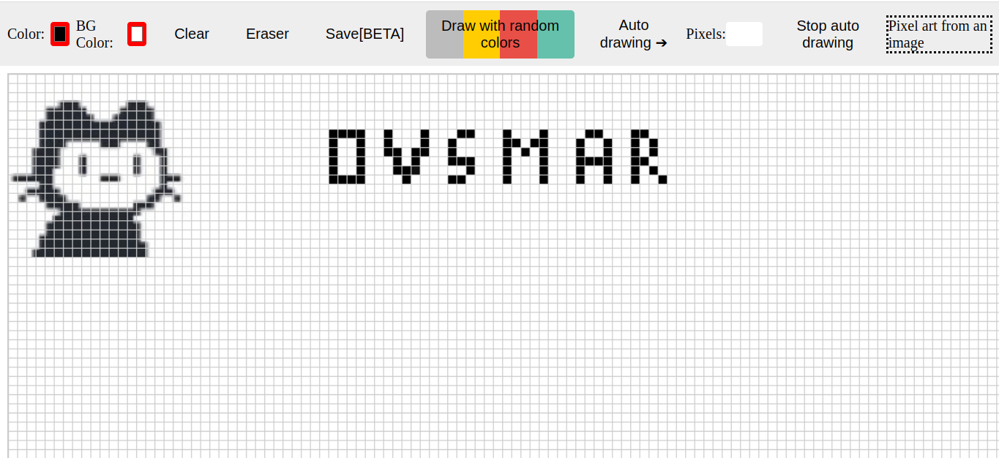
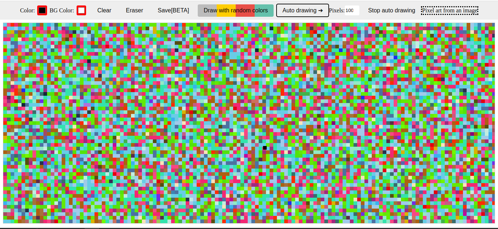
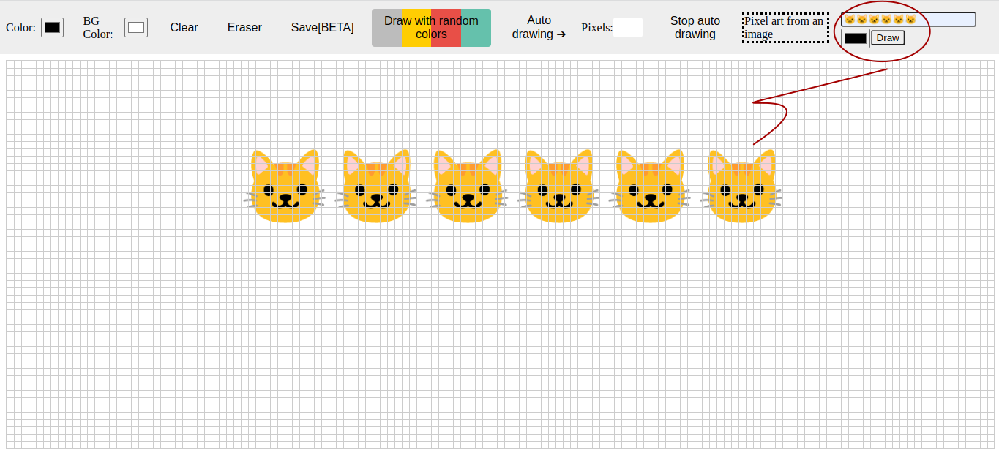

# Pixel Art Maker

**DEMO**

- [Pixel Art Maker](https://ovsmar.github.io/Pixel-Art-Maker/)



### The hell...



### Cats 🐱...



## About Pixel Art Maker

!NOTE: This project was created as a way for me to learn and have fun. It is not the most effective method for creating a Pixel Art Maker because there are still bugs to fix and not everything functions as intended.

```
Pixel Art Maker est une application de dessin  qui permet de créer de l'art en pixels sur un canevas en utilisant divers outils et fonctionnalités. Ces outils incluent une grille pour aider à l'alignement, la possibilité de choisir des couleurs et de définir la couleur de fond, la possibilité de effacer le canevas, un outil gomme,  la possibilité de dessiner avec des couleurs aléatoires et une fonction de dessin automatique et de téléchargement. De plus, l'application permet de créer de l'art en pixels à partir d'une image en utilisant les méthodes "drawImage" et "getImageData" de l'objet de contexte de canevas pour manipuler les données de pixels de l'image et dessiner une version en pixels sur le canevas. Le projet est mis en œuvre à l'aide de JavaScript , HTML et CSS, avec des écouteurs d'événements ajoutés pour permettre l'interaction de l'utilisateur et les diverses fonctionnalités de l'application.

```

The project begins by declaring several variables that reference HTML elements on the page, such as the canvas element, color picker elements, button elements, and more. It also declares a variable called "isDrawing" that is used to track whether the user is currently drawing on the canvas.

The project includes a function called "drawGrid" that is used to draw a grid on the canvas to help the user align their drawings with a pixel grid. The function sets the stroke style and line width of the canvas context object, and then calculates the size of the grid cells based on a constant called "gridSize". It then iterates over the width and height of the canvas, drawing vertical and horizontal lines at intervals of "gridSize" pixels to create the grid.

The project also includes a function called "drawPixel" that is used to draw a pixel on the canvas at a specified x and y coordinate. The function snaps the pixel to a grid of a certain size by using the "floor" function and the modulo operator to calculate the nearest multiple of "gridSize" to the specified x and y coordinates. It then uses the "fillRect" method of the canvas context object to draw a filled rectangle at the snapped x and y coordinates, with a width and height of "gridSize" pixels.

Next, the project adds several event listeners to various elements on the page to enable various features of the drawing application. For example, it adds an event listener to the "mousedown" event of the canvas element that listens for mouse clicks and enables drawing on the canvas. When the user clicks the mouse button while hovering over the canvas, the event listener is triggered and the "drawPixel" function is called to draw a pixel at the mouse position.

The project also adds an event listener to the "mousemove" event of the canvas element that listens for mouse movement and enables continuous drawing on the canvas while the mouse button is held down. When the user moves the mouse over the canvas while holding down the mouse button, the event listener is triggered repeatedly and the "drawPixel" function is called to draw a In addition to the canvas event listeners, the project adds event listeners to several other elements on the page to enable other features. For example, it adds an event listener to the "input" event of the "colorPicker" element that listens for changes to the color picker value and updates the drawing color on the canvas accordingly. It also adds an event listener to the "input" event of the "colorBG" element that listens for changes to the color picker value and updates the background color of the canvas, as well as storing the selected color in the browser's local storage.

The project also includes an event listener for the "load" event of the "window" object that sets the canvas background color to a stored value and updates the "colorBG" element to match when the page loads. This allows the user to persist their selected background color across page loads.

The project includes an event listener for the "click" event of the "clearButton" element that clears the canvas, reloads the webpage, and redraws the grid on the canvas when the button is clicked. It also includes an event listener for the "click" event of the "eraserButton" element that updates the canvas context's fill style to white, allowing the user to erase pixels from the canvas by drawing over them.

The project includes an event listener for the "click" event of the "randomColorButton" element that updates the canvas context's fill style to a randomly generated color when the button is clicked. This allows the user to draw with random colors by clicking the button and then drawing on the canvas.

The project includes an event listener for the "click" event of the "drawButton" element that starts an interval timer that continuously calls the "drawPixel" function at a certain interval, effectively enabling auto drawing on the canvas. The interval timer is stopped when the "stopButton" element is clicked, or when the user mouses up from the canvas.

The project also includes a function called "createPixelArt" that takes an image file as input and converts it into pixel art on the canvas. The function loads the image file using an image element and the "src" attribute, and then iterates over the image data of the canvas context, calling the "drawPixel" function to draw a pixel on the canvas for each pixel in the image.

The project also includes a function called "getPixelColor" that takes an x and y coordinate as input and returns the color of the pixel at that position on the canvas. The function uses the "getImageData" method of the canvas context to retrieve the image data for a certain area of the canvas, and then returns the color of the pixel at the specified x and y coordinate within that image data.

The project also includes a feature that allows users to draw letters or numbers on a canvas element by entering text in an input field, selecting a color using a color picker, and clicking a submit button. When the submit button is clicked, the text is drawn on the canvas in the selected color. If the user clicks the submit button again, the canvas is cleared and the user can draw new text.

Overall, these additional features provide further customization and flexibility to the drawing experience, allowing the user to draw with random colors, enable auto drawing, and create pixel art from image files.

Finally, the project includes an event listener for the "click" event of the "saveButton" element that allows the user to save their drawing as a PNG image file by opening a new window or tab with the image data URL as the address and modifying the data URL to force the browser to download the image data as a file.

Overall, this project provides drawing experience for users, with a variety of customization options . It makes use of event listeners and functions to enable drawing, color selection, canvas clearing, image saving, and more...
